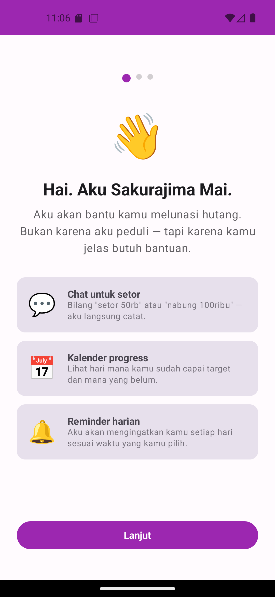
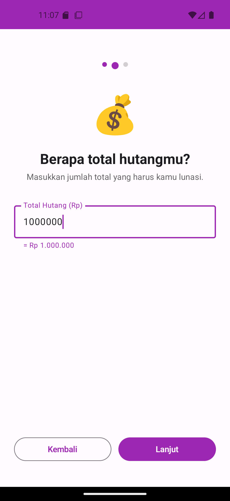
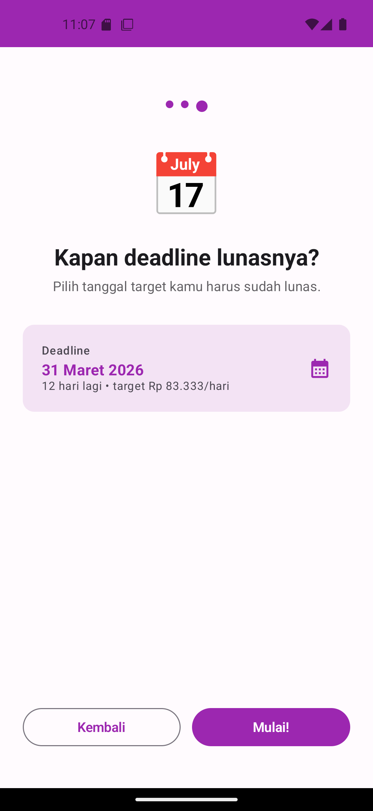
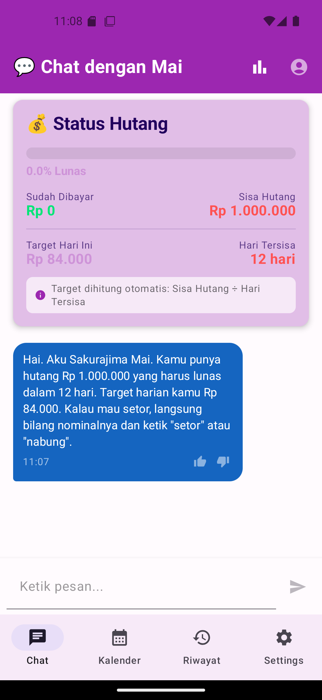

# Halo, aku Sendy 👋

Developer yang suka membangun hal-hal yang **bermanfaat nyata** — bukan sekadar latihan teknis.
Mayoritas project ku lahir dari kebutuhan sendiri: butuh pengingat hutang yang engaging, butuh tracker sholat yang simpel, butuh enkripsi file yang bisa dipakai langsung.

---

## 🛠️ Tech Stack

---

## 📦 Project

### 💸 [DebtSlayer](https://github.com/sndiy/DebtSlayer)
> *Aplikasi Android untuk melacak cicilan hutang harian dengan AI chatbot karakter Sakurajima Mai*

Berawal dari kebutuhan nyata: butuh cara yang lebih engaging buat konsisten setor cicilan tiap hari.
Solusinya? Bikin chatbot dengan karakter anime tsundere yang bakal "marah" kalau kamu telat setor.

**Yang menarik secara teknis:**
- Arsitektur MVVM dengan Room database + DataStore
- Integrasi Gemini 2.5 Flash Lite sebagai AI engine
- Sistem kepribadian adaptif (Strict / Balanced / Gentle) yang mengubah tone respons AI
- Widget homescreen untuk progress real-time
- AlarmManager + BroadcastReceiver untuk notifikasi harian yang persist setelah reboot

`Kotlin` `Jetpack Compose` `MVVM` `Room` `Gemini AI`

  
  
  
  

---

### 💬 [ChatFin](https://github.com/sndiy/ChatFin)
> *Chatbot untuk laporan keuangan dengan karakter kustom*

Eksperimen menggabungkan AI conversation dengan data keuangan personal.
Tujuannya: membuat laporan keuangan terasa seperti ngobrol, bukan mengisi spreadsheet.

`Kotlin` `Android` `AI Chatbot`

---

### 🔐 [File Encryptor](https://github.com/sndiy/file_encryptor)
> *Enkripsi dan dekripsi file menggunakan hybrid encryption RSA + AES*

Dibuat untuk memahami konsep **trapdoor function** secara hands-on, sekaligus jadi tool yang bisa dipakai langsung.

**Yang menarik secara teknis:**
- Hybrid encryption: RSA 2048-bit untuk mengenkripsi kunci AES, AES 256-bit untuk mengenkripsi data
- Pemrosesan chunk 64KB — bisa handle file berukuran GB tanpa OOM
- Secure delete untuk menghapus file original secara permanen

`Python` `Cryptography` `RSA` `AES`

---

### 🕌 [SholatTracker](https://github.com/sndiy/SholatTracker)
> *Tracker sholat harian untuk Android*

Aplikasi simpel dengan fokus pada konsistensi — streak tracker, notifikasi per waktu sholat, dan widget homescreen.

**Fitur:**
- Streak tracker hari berturut-turut sholat lengkap
- Export PDF laporan harian
- Widget 2x2 dengan progress & jadwal sholat berikutnya
- Notifikasi yang tetap aktif setelah reboot (via BOOT_COMPLETED)

`Kotlin` `Material Design 3` `AlarmManager` `PDF Export`

---

### 🌱 [Petanik Kromong Berdaya](https://petanikromongberdaya.com)
> *Website komunitas petani berbasis WordPress*

Project yang paling punya impact nyata — platform untuk membantu petani di Desa Kromong mengakses informasi pertanian, pemasaran, dan pemberdayaan komunitas.

Dibangun sendiri dari nol: setup WordPress, konfigurasi hosting, custom plugin dengan AI.

`WordPress` `PHP` `Community Platform`

---

## 🤝 Cara Kerja

Aku menggunakan AI (Claude & Gemini) sebagai **alat bantu dalam proses development** — bukan sebagai pengganti pemikiran.
Setiap project dimulai dari identifikasi masalah nyata, keputusan arsitektur, dan desain pengalaman pengguna yang aku tentukan sendiri.
AI membantu mempercepat implementasi; ide, konteks, dan judgement tetap dari manusianya.

---

## 📫 Kontak

Kalau ada yang mau didiskusikan soal project atau kolaborasi, feel free reach out.